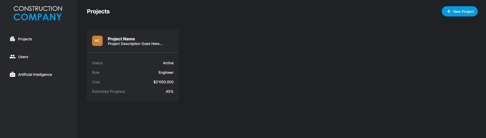
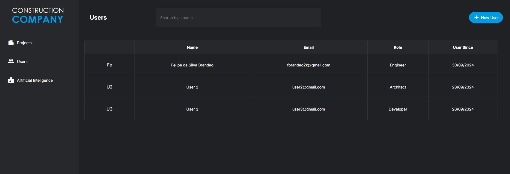
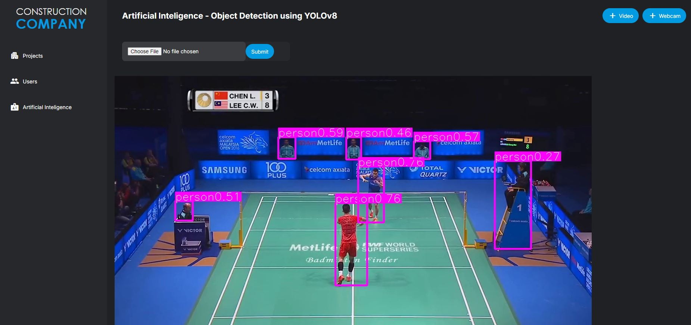

# FullStack_ProjectInventory
Project Inventory with a list of projects and users. Backend = Flash API Python / Frontend = Html/Css

## Instructions

Go to the folder directory, then run

```bash
python ./flaskapp.py
```
Then go to the web browser, and open http://127.0.0.1:5000

## Built With

* [Flask](https://flask.palletsprojects.com/en/1.1.x/) - The web framework used
* [Python](https://www.python.org/) - Language used
* [Html](https://html.com/) - The web language used
* [Css](https://www.w3.org/Style/CSS/Overview.en.html) - The style language used

## Features

### Projects Page



### Users Page



### Artificial Intelligence Page

### Real-time video processing with YoloV8



### Real-time webcam processing with YoloV8


## Acknowledgments

Html template from the course Master BIM Dev from ThatOpenCompany, and flaskapp.py based on Udemy course "YOLOv8, Train Custom Dataset, Object Detection, Segmentation, Tracking, Real World 17 + Projects & Web Apps in Python".